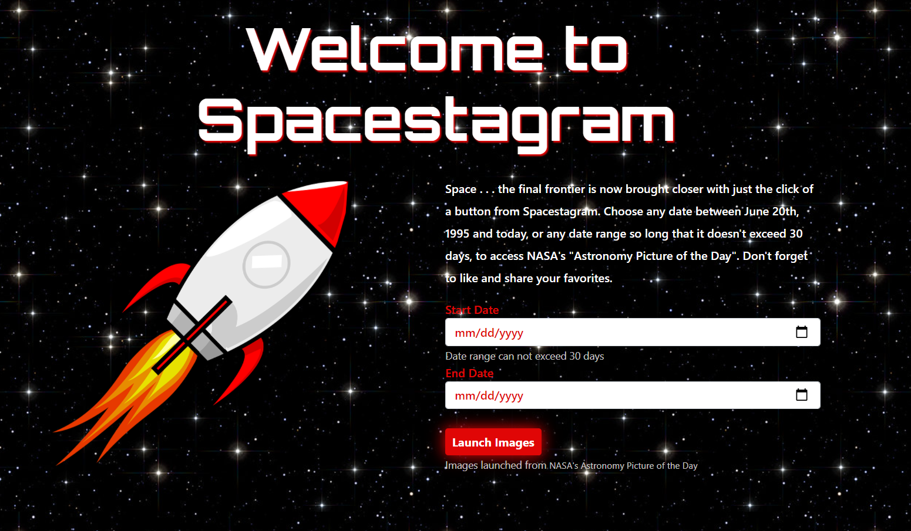
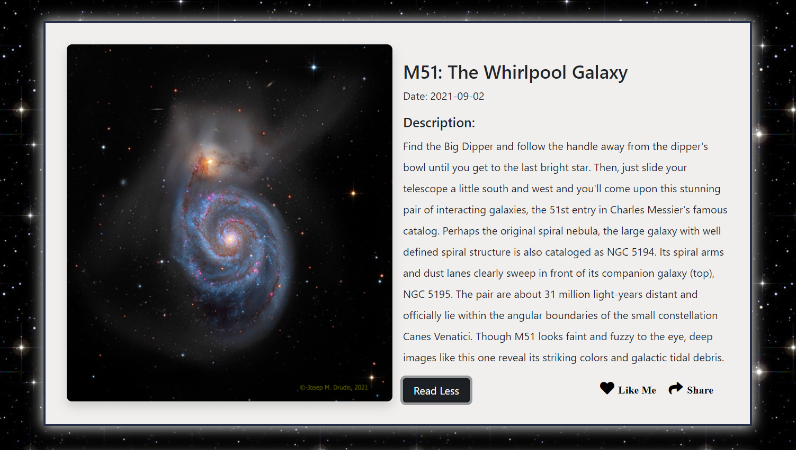

# NASA'S API :rocket: Spacestagram! :flying_saucer:
### Shopify's Front End Developer Intern Challenge - Winter 2022

<!-- PROJECT LOGO -->

  

<!-- TABLE OF CONTENTS -->
<details open="open">
  <summary>Table of Contents</summary>
  <ol>
    <li>
      <a href="#about-the-app">About The APP</a>
      <ul>
        <li><a href="#mechanics-and-features">Mechanics and Features </a></li>
        <li><a href="tech-stack">Tech Stack</a>
      </ul>
    </li>
        <li><a href="#installation">Installation</a></li>
    <li><a href="#link">Link to Deployed App</a></li>
    <li><a href="#demo-and-images">Video Demo and Images</a></li>
    <li><a href="#contact-info">Contact</a></li>
  </ol>
</details>

<!-- About The Game -->
# About The App:

## Mechanics and Features: 

- Choose a date or date range to access NASA's Astronomy Picture of the Day.
- Click button to "Launch Images".
- Clear input fields after submit 
- Header with a reminder of the date range choosen 


- Like and dislike images.
- Share link (surprise).
- Jump to proper location after NASA cards are rendered 
- Clickable read more/read less feature that puts the control in the users hand.
- Fully responsive and mobile ready 


<!-- Tech Stack -->
## Tech Stack:

Spacestagram is built from scratch using HTML5, CSS, JavaScript, Bootstrap and NASA's API. 

* [HTML5 Canvas](https://developer.mozilla.org/en-US/docs/Web/API/Canvas_API/Tutorial)
* [CSS](https://developer.mozilla.org/en-US/docs/Learn/CSS)
* [JavaScript](https://javascript.info/)
* [Bootstrap](https://getbootstrap.com/2.0.2/)
* [NASA API](https://api.nasa.gov/)


<!-- GETTING STARTED -->

# Installation

```sh
-Clone repository using the command git clone https://github.com/Tamsauce/NasaAPI.git
-Open file in code editor
```
  


<!-- links -->
# Link

* Click to visit deployed site: [NASA Spacestagram](https://nasaspacestagram.netlify.app/)

<!-- Video Demo -->
# Demo and Images 

https://user-images.githubusercontent.com/74758886/134124984-f64a3a9e-c84e-475c-82aa-fa48e380d678.mp4





<!-- CONTACT -->


# Contact Info
### Tami Hughes
* [Twitter](https://twitter.com/Tamsaucce)
* [LinkedIn](https://www.linkedin.com/in/tami-hughes-58074a72)
* [Portfolio](https://www.tamsauce.com/)
* [Resume](https://drive.google.com/file/d/1Dm8knTjruPMSJEQv59XsX41nWwVQkpe3/view?usp=sharing)
* Email: thughes78@gmail.com


<!-- MARKDOWN LINKS & IMAGES -->
<!-- https://www.markdownguide.org/basic-syntax/#reference-style-links -->
[contributors-shield]: https://img.shields.io/github/contributors/othneildrew/Best-README-Template.svg?style=for-the-badge
[contributors-url]: https://github.com/othneildrew/Best-README-Template/graphs/contributors
[forks-shield]: https://img.shields.io/github/forks/othneildrew/Best-README-Template.svg?style=for-the-badge
[forks-url]: https://github.com/othneildrew/Best-README-Template/network/members
[stars-shield]: https://img.shields.io/github/stars/othneildrew/Best-README-Template.svg?style=for-the-badge
[stars-url]: https://github.com/othneildrew/Best-README-Template/stargazers
[issues-shield]: https://img.shields.io/github/issues/othneildrew/Best-README-Template.svg?style=for-the-badge
[issues-url]: https://github.com/othneildrew/Best-README-Template/issues
[license-shield]: https://img.shields.io/github/license/othneildrew/Best-README-Template.svg?style=for-the-badge
[license-url]: https://github.com/othneildrew/Best-README-Template/blob/master/LICENSE.txt
[linkedin-shield]: https://img.shields.io/badge/-LinkedIn-black.svg?style=for-the-badge&logo=linkedin&colorB=555
[linkedin-url]: https://linkedin.com/in/othneildrew
[product-screenshot]: images/screenshot.png
